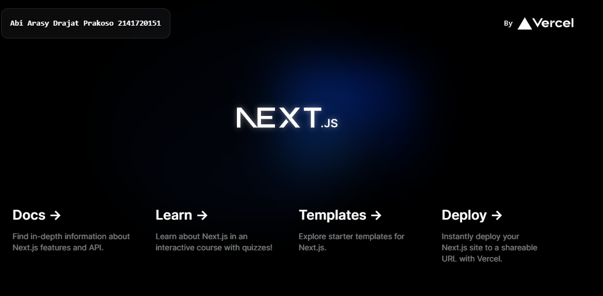

Name:Abi Arasy Drajat  Prakoso
Class/Absent:TI 3I/01
NIM:2141720151

Soal 1
Pada gambar tersebut, silakan Anda browsing apa yang dimaksud dengan:

TypeScript
ESLint
Tailwind CSS
App Router
Import alias 

Jawaban:

TypeScript:
TypeScript adalah superset dari JavaScript yang menambahkan fitur-fitur seperti tipe data statis, kelas, dan modul. TypeScript membantu pengembang untuk menulis kode yang lebih terstruktur, mudah dibaca, dan terhindar dari error.

ESLint:

ESLint adalah alat yang membantu pengembang untuk menemukan dan memperbaiki masalah dalam kode JavaScript mereka. ESLint dapat mendeteksi berbagai macam masalah, seperti kode yang tidak terformat dengan benar, kode yang tidak efisien, dan kode yang berpotensi menimbulkan error.

Tailwind CSS:

Tailwind CSS adalah framework CSS utility-first yang membantu pengembang untuk membangun UI web dengan cepat dan mudah. Tailwind CSS menyediakan berbagai macam kelas CSS yang dapat digunakan untuk menata elemen HTML dengan mudah.

App Router:

App Router adalah fitur Next.js yang membantu pengembang untuk menavigasi antar halaman dalam aplikasi Next.js. App Router memungkinkan pengembang untuk membuat URL yang mudah dipahami dan digunakan.

Import alias:

Import alias adalah fitur TypeScript yang memungkinkan pengembang untuk mengimpor modul dengan nama yang lebih pendek dan lebih mudah diingat. Import alias dapat membantu pengembang untuk menulis kode yang lebih ringkas dan mudah dibaca.

Soal 2
Pada struktur project tersebut, jelaskan kegunaan folder dan file masing-masing tersebut!
Folder:

.git: Digunakan untuk menyimpan source code project dengan Git.
node_modules: Menyimpan semua dependensi yang diinstal untuk project.
public: Menyimpan file statis yang akan diakses langsung oleh browser, seperti gambar, CSS, dan JavaScript.
src: Menyimpan source code utama project Next.js.
File:

SFC: File komponen React yang ditulis dengan menggunakan sintaks JSX.
eslintrc.json: File konfigurasi ESLint untuk mendefinisikan aturan linting code.
.gitignore: File yang berisi daftar file yang tidak ingin dikomit ke Git repository.
next.config.mjs: File konfigurasi Next.js untuk mengatur berbagai aspek project.
next-env.d.ts: File TypeScript untuk mendefinisikan variabel environment khusus Next.js.
package.json: File yang berisi informasi tentang project, seperti nama, versi, dependensi, dan skrip.
package-lock.json: File yang berisi daftar dependensi yang diinstal dan versi spesifiknya.
postcss.config.js: File konfigurasi PostCSS untuk mendefinisikan plugin dan preset yang digunakan untuk memproses CSS.
README.md: File markdown yang berisi informasi tentang project, seperti deskripsi, cara penggunaan, dan dokumentasi.
tailwind.config.ts: File konfigurasi Tailwind CSS untuk mendefinisikan kelas CSS yang tersedia.
tsconfig.json: File konfigurasi TypeScript untuk mendefinisikan compiler options.

Soal 3
Gantilah teks pada bagian atas dengan Nama - NIM Anda. Contoh seperti gambar berikut:

Jawaban dibuktikan dengan hasil screenshot.

Ketika Anda telah berhasil mengganti teks tersebut, Anda tidak perlu menjalankan perintah npm run dev dan tidak juga diperlukan me-reload halaman di browser. Tiba-tiba perubahan itu tampil, Mengapa terjadi demikian? Jelaskan!

Cobalah buat project react lainnya dengan menggunakan framework Remix dan Gatsby. Ini tidak perlu di push, cukup screenshot dan jelaskan perbedaannya diantara ketiga framework tersebut (termasuk Next.js) di file README nomor 1.

Jawaban:

Remix: Cocok untuk aplikasi web yang membutuhkan performa tinggi dan navigasi tanpa refresh.
Gatsby: Cocok untuk website statis yang membutuhkan SEO optimal dan kemudahan penggunaan.
Next.js: Cocok untuk aplikasi web yang kompleks dan membutuhkan fleksibilitas.

Tergantung penggunaan user maka tiap framework memiliki kegunaan dan kekurangan masing masing 
